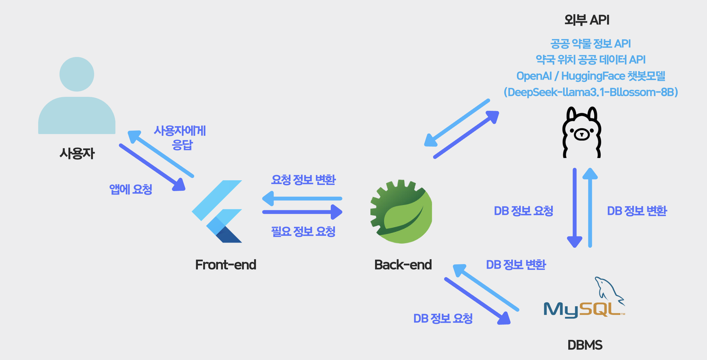
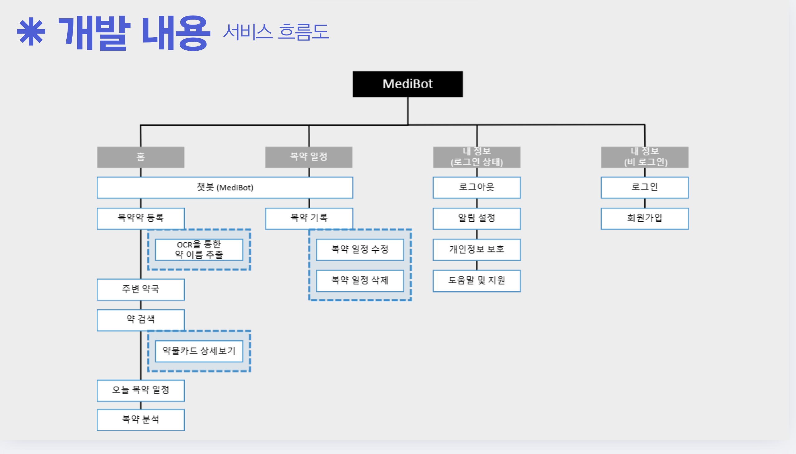
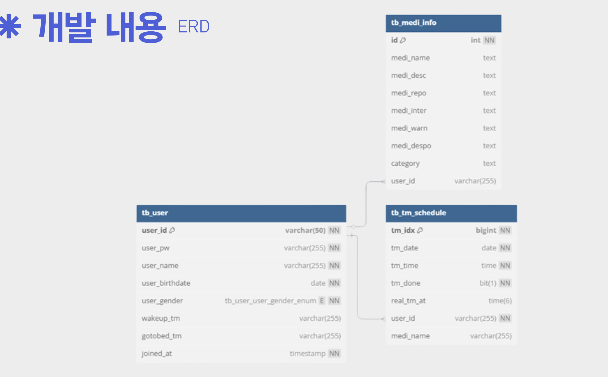
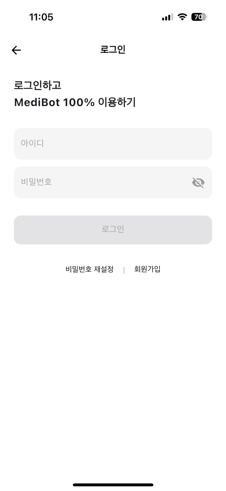
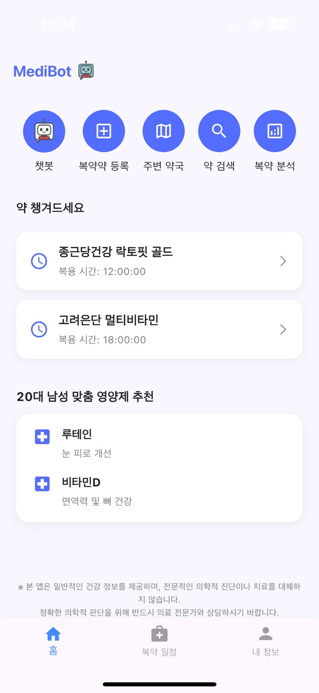
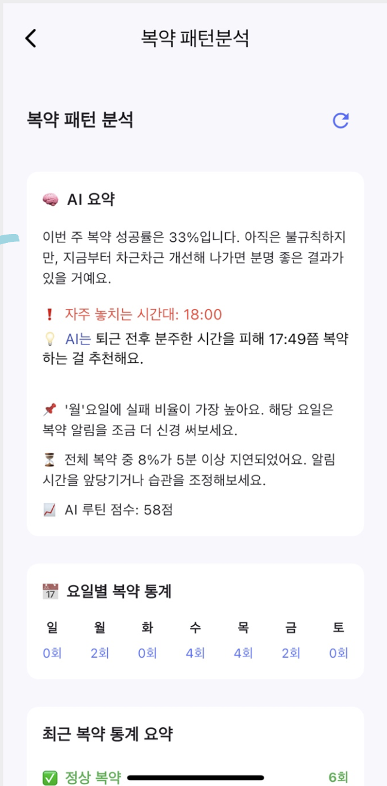
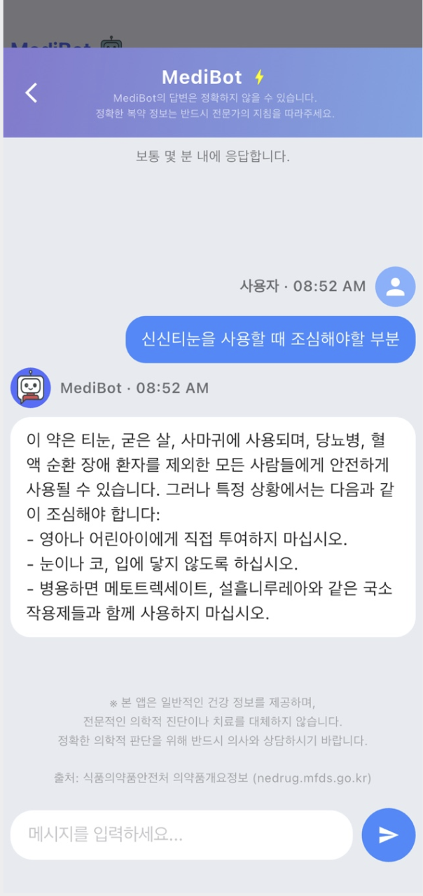
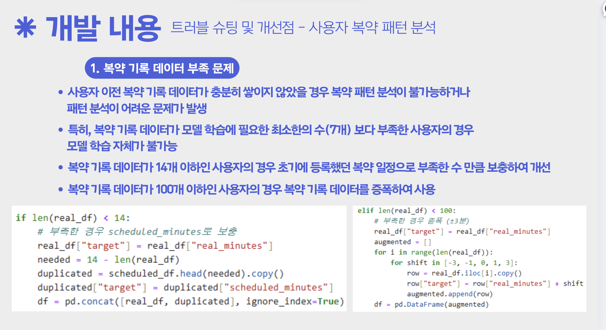
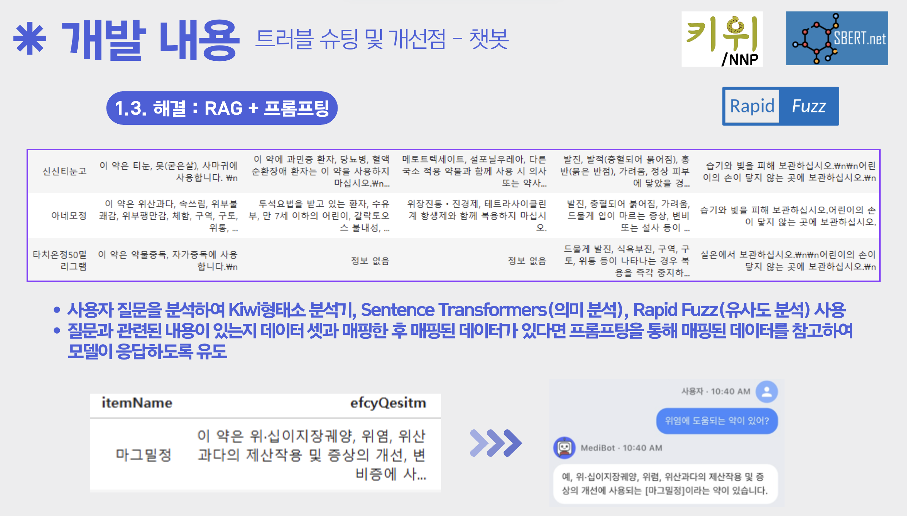

# 💊 스마트 복약 도우미 서비스 - MediBot

## 👀 서비스 소개
* **서비스명** : MediBot - 당신의 건강한 복약 습관을 위한 AI 기반 복약 도우미
* **서비스 설명** : 약 이름을 자동으로 인식하고, 복약 알림, 부작용 기록, AI 챗봇 등 다양한 기능을 통해 사용자의 건강을 지켜주는 스마트 복약 관리 서비스입니다.

## 📅 프로젝트 기간
2025.03.14 ~ 2025.04.09

## ⭐ 주요 기능
* 약 이름 자동 인식 (OCR)
* 복약 스케줄 관리 및 알림
* 부작용 메모 기록
* 복약 패턴 리포트 제공
* AI 약물 상담 챗봇
* 주변 약국/병원 검색 (Kakao Map API)

## ⛏ 기술스택
<table>
    <tr><th>구분</th><th>내용</th></tr>
    <tr><td>Back-End</td><td>
        
         
         
    </td></tr>
    <tr><td>Front-End</td><td>
        
        
    </td></tr>
    <tr><td>AI / OCR</td><td>
        
        
    </td></tr>
    <tr><td>IDE</td><td>
        
        
    </td></tr>
    <tr><td>데이터베이스</td><td>
        
    </td></tr>
    <tr><td>협업도구</td><td>
        
        
    </td></tr>
</table>

## ⚙ 시스템 아키텍처(예시)

## 📌 유스케이스 & 서비스 흐름도

## 📌 ER다이어그램

## 🖥 화면 구성

### 회원가입 / 로그인

### 메인 화면 (오늘의 복약, 키워드, 알림 등)

### 복약 분석 피드백

### AI 챗봇 화면 / 부작용 기록 화면

## 👨‍👩‍👦‍👦 팀원 역할 (예시)
| 이름 | 역할 | 주요 담당 | GitHub |
|------|------|-----------|--------|
| 김수지 | PM / Data Modeling | PM, LLAMA 모델 모델링 | [GitHub](https://github.com/Suji2i) |
| 이은정 | Back-End | 백엔드 API 설계, 발표 | [GitHub](https://github.com/jmueeo) |
| 오도영 | Full Stack, DB | 앱 전체 UI,UX , 백엔드 API, DB 구성| [GitHub](https://github.com/ohdoyoung) |
| 정희석 | PM / Front-End | LLAMA 모델 모델링 |  |
| 노이린 | DB | DB, 산출문서 |  |

## 🤾‍♂️ 트러블슈팅

* 문제1 
   

* 문제2 
   

---

> 본 프로젝트는 사용자 건강을 위한 스마트 복약 도우미 앱으로, AI와 OCR 기술을 접목해 약 복용의 편의성을 높이는 데에 중점을 두었습니다. MediBot은 앞으로도 지속적으로 개선될 예정입니다. 💙

https://apps.apple.com/us/app/medibot/id6744045976
